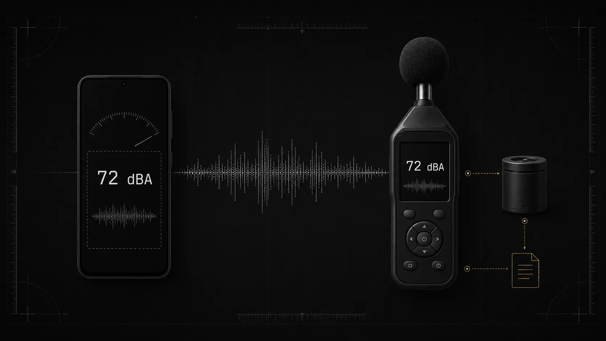

Ein professionelles Messgerät ist nicht automatisch für jede Frage nötig. Der eigentliche Unterschied zwischen Schallpegelmesser-App und Messgerät liegt darin, welche Folgen ein falscher Wert hätte.

Für private Vergleiche und eine erste Einschätzung reicht das Handy häufig aus. Sobald ein Messwert normgerecht, rückführbar oder rechtlich belastbar sein muss, braucht es ein geeignetes professionelles Messsystem und ein festgelegtes Verfahren. Die App bleibt eine Schätzung, auch wenn ihre Oberfläche präzise wirkt.

[Wie genau sind Dezibel-Apps?](/de/artikel/sind-dezibel-apps-genau/)

## Schallpegelmesser-App vs Messgerät im Überblick

| Bereich                       | Schallpegelmesser-App auf dem Handy                                           | Professionelles Schallpegelmessgerät                                                             |
| ----------------------------- | ----------------------------------------------------------------------------- | ------------------------------------------------------------------------------------------------ |
| Typischer Einsatz             | Orientierung, Vorprüfung, Unterricht, private Vergleiche                      | Arbeitsschutz, Umweltmessungen, Akustikplanung, Forschung und amtliche Verfahren                 |
| Mikrofon                      | Für Sprache, Telefonie, Videos und Medienaufnahmen entwickelt                 | Messmikrofon mit dokumentierten akustischen Eigenschaften                                        |
| Kalibrierung                  | Häufig nur ein Korrekturwert oder gerätespezifisches Profil                   | Kontrollmessung mit Schallkalibrator und dokumentierte Laborkalibrierung                         |
| Unterschiede zwischen Geräten | Je nach Handymodell, Betriebssystem und Audioverarbeitung teilweise erheblich | Technische Eigenschaften des vollständigen Messsystems sind spezifiziert                         |
| Frequenzbewertung             | Abhängig von App, Mikrofon und Audio-Signalweg                                | Normgerecht geprüfte A-, C- oder Z-Bewertung, sofern vom Gerät unterstützt                       |
| Hohe Pegel und kurze Spitzen  | Kompression, Clipping oder übersehene Spitzen möglich                         | Definierter Messbereich, Übersteuerungsanzeige und geeignete Spitzenwertmessung                  |
| Offizielle Verwendung         | Normalerweise nicht als alleiniger Nachweis geeignet                          | Je nach Verfahren mit passender Geräteklasse, Kalibrierung und gegebenenfalls Eichung einsetzbar |
| Kosten                        | Gering, sofort verfügbar                                                      | Kauf, Miete, Kalibrierung, Zubehör und Fachkenntnis verursachen zusätzliche Kosten               |

Die Tabelle beschreibt typische Einsatzbereiche. Ein ausgewähltes Smartphone-System mit externem Messmikrofon kann unter kontrollierten Bedingungen erstaunlich gute Ergebnisse liefern. Umgekehrt kann auch ein hochwertiges Messgerät falsche Werte erzeugen, wenn es falsch eingestellt, ungünstig positioniert oder außerhalb seines Messbereichs verwendet wird. Studien zeigen, dass speziell geprüfte Kombinationen aus App und kalibriertem externem Mikrofon nahe an Referenzsysteme herankommen können. Daraus lässt sich jedoch keine allgemeine Genauigkeit für beliebige Handys und Apps ableiten.

## Wann reicht eine Schallpegelmesser-App aus?

Eine App ist sinnvoll, wenn keine weitreichende Entscheidung von wenigen Dezibel abhängt. Typische Anwendungsfälle sind:

* dasselbe Haushaltsgerät vor und nach einer Reparatur vergleichen
* lautere und leisere Bereiche in einer Wohnung erkennen
* den ruhigsten Platz für einen Schreibtisch suchen
* verschiedene Strecken zur Arbeit miteinander vergleichen
* Veränderungen mit demselben Handy über längere Zeit beobachten
* im Unterricht die logarithmische Dezibelskala demonstrieren
* prüfen, ob eine professionelle Lärmmessung sinnvoll sein könnte
* eine Lärmbeschwerde mit Zeitangaben und geschätzten Pegeln ergänzen

Für vergleichbare Ergebnisse sollten immer dasselbe Handy, dieselbe App, dieselbe Ausrichtung, derselbe Abstand, dieselbe Frequenzbewertung und eine ähnliche Messdauer verwendet werden. Unterschiede von nur ein oder zwei Dezibel sollten bei einer unkalibrierten Handy-Messung nicht überbewertet werden.

[Dezibel mit einem Android-Handy messen](/de/artikel/dezibel-messen-mit-android-handy/)

## Wann wird ein professionelles Messgerät benötigt?

Ein geeignetes professionelles Messsystem ist die bessere Wahl, wenn das Ergebnis:

* die Einhaltung von Arbeitsschutzvorgaben belegen soll
* in einem behördlichen Lärmverfahren verwendet wird
* Bestandteil eines Gutachtens ist
* über bauliche oder technische Schallschutzmaßnahmen entscheidet
* für Produktprüfung, Maschinenabnahme oder Zertifizierung benötigt wird
* nahe an einem rechtlich oder technisch wichtigen Grenzwert liegt
* starke Impulse oder sehr kurze Spitzen erfassen soll
* tieffrequente oder tonhaltige Geräusche bewerten soll
* für wissenschaftliche Untersuchungen rückführbar sein muss
* in einem Gerichtsverfahren oder Streitfall vorgelegt wird
* eine sicherheitsrelevante Entscheidung beeinflusst

Je nach Aufgabe ist zusätzlich eine Fachperson aus Akustik, Immissionsschutz oder Arbeitshygiene erforderlich. Die Auswahl des Messorts, die Messdauer und die Auswertung können ebenso wichtig sein wie das Gerät selbst.

## Der wichtigste Unterschied liegt nicht in der App

Bei der Frage, ob ein Handy den Schallpegel genau messen kann, wird häufig nur die Software betrachtet. Tatsächlich bestimmt die gesamte Messkette das Ergebnis:

* Mikrofon
* Mikrofonvorverstärker
* analoge und digitale Signalverarbeitung
* automatische Verstärkungsregelung
* Filter und Rauschunterdrückung
* Betriebssystem und gewählte Audioquelle
* Berechnungsmethode der App
* Kalibrierung
* Position und Ausrichtung des Geräts

Smartphone-Mikrofone sind in erster Linie für Gespräche, Sprachaufnahmen, Videos und Geräuschunterdrückung ausgelegt. Hersteller veröffentlichen normalerweise keine vollständigen Daten zu Frequenzgang, Eigenrauschen, Richtwirkung oder maximalem Schalldruckpegel für akustische Messungen.

Moderne Telefone besitzen oft mehrere Mikrofone. Das Betriebssystem kann zwischen ihnen wechseln, Signale kombinieren oder Algorithmen wie Beamforming und automatische Verstärkungsregelung anwenden. Die App erhält dann möglicherweise bereits bearbeitetes Audiomaterial. Den ursprünglichen Schalldruck vor dieser Verarbeitung kann sie nicht rekonstruieren.

Ein professionelles Gerät verwendet dagegen ein Messmikrofon und eine Elektronik, deren Eigenschaften für Schallmessungen dokumentiert sind. Dazu gehören unter anderem Messbereich, Frequenzbereich, Eigenrauschen, Übersteuerungsgrenze, Zeitbewertung und zulässige Umgebungsbedingungen.

## Was passiert oberhalb von etwa 90 dB?

Bei vielen Smartphones werden Messungen oberhalb von etwa 90 dB zunehmend unsicher. Das ist keine feste Grenze für alle Geräte. Einige Mikrofone beginnen früher zu komprimieren, andere bleiben bei höheren Pegeln noch annähernd linear. Die genaue Übersteuerungsgrenze ist bei einem gewöhnlichen Handy meist nicht dokumentiert.

Beim Clipping erreicht das elektrische Signal die maximal darstellbare Amplitude. Die Signalspitzen werden abgeschnitten, obwohl der tatsächliche Schalldruck weiter steigt. Eine automatische Verstärkungsregelung kann den Pegel ebenfalls reduzieren. In diesem Fall zeigt die App unter Umständen weiterhin plausible Zahlen an, obwohl der tatsächliche Anstieg nicht mehr korrekt erfasst wird.

Eine Anzeige bis 120 oder 130 dB bedeutet deshalb nicht, dass das Handy diesen Bereich korrekt messen kann. Sie zeigt lediglich, welche Zahlen die Benutzeroberfläche darstellen kann.

Professionelle Messgeräte besitzen definierte Pegelbereiche und eine Übersteuerungsanzeige. Auch hier muss der passende Messbereich gewählt werden. Ein Warnsymbol für Übersteuerung darf nicht ignoriert werden.

## Kalibrierung, Justierung und Eichung sind nicht dasselbe

Bei einer App besteht die sogenannte Kalibrierung häufig aus einem einzelnen Korrekturwert. Zeigt ein Referenzgerät beispielsweise 70 dB(A) und die App 67 dB(A), wird ein Offset von +3 dB gespeichert.

Das kann die Übereinstimmung in der Nähe dieses Kalibrierpunkts verbessern. Es beweist jedoch nicht, dass das Handy bei 35, 85 oder 100 dB ebenso korrekt misst. Auch Fehler im Frequenzgang, eine nichtlineare Verstärkung oder abgeschnittene Spitzen werden durch einen einfachen Offset nicht behoben.

Bei einem professionellen Messablauf wird das Gerät üblicherweise vor und nach der eigentlichen Messung mit einem akustischen Schallkalibrator kontrolliert. Zusätzlich kann eine regelmäßige Kalibrierung in einem geeigneten Labor erforderlich sein. Im Messbericht werden unter anderem das verwendete Gerät, der Kalibrator, die Kalibrierdaten, das Messverfahren und die Messunsicherheit dokumentiert. Die TRLV Lärm verlangt für Arbeitsplatzmessungen eine nachvollziehbare Dokumentation dieser Punkte.

Eine Kalibrierung ermittelt und dokumentiert die Abweichung eines Messgeräts von einer rückführbaren Referenz. Eine Justierung verändert das Gerät, um diese Abweichung zu verringern. Eine Eichung ist dagegen eine gesetzlich geregelte Prüfung für bestimmte Messgeräte und Verwendungszwecke.

Der Ausdruck "geeichtes Messgerät" ist kein allgemeines Synonym für "genaues Messgerät". Welche Anforderungen gelten, hängt vom konkreten Verfahren ab.

## Wann ist in Deutschland ein geeichtes Messgerät nötig?

Für private Messungen gibt es normalerweise keine Pflicht, ein geeichtes Schallpegelmessgerät zu verwenden. Anders sieht es aus, wenn der Wert als offizieller Nachweis dienen soll.

Bei behördlich verwertbaren Immissionsmessungen nach der Technischen Anleitung zum Schutz gegen Lärm sind geeichte Schallpegelmesser der Klasse 1 vorgesehen. Die TA Lärm stellt außerdem Anforderungen an das Messverfahren, die Auswertung und die Beurteilung der Geräusche. Eine Handy-App kann eine mögliche Belastung dokumentieren, ersetzt diese amtliche Messung aber nicht.

Auch bei anderen rechtlich relevanten Messungen reicht es nicht, lediglich ein Gerät mit hoher Displayauflösung zu verwenden. Maßgeblich sind die jeweils geltende Vorschrift, die Geräteklasse, der Kalibrierstatus, die Messstrategie, die Umgebungsbedingungen und die dokumentierte Messunsicherheit.

Für Arbeitsplatzmessungen gelten beispielsweise die Lärm- und Vibrations-Arbeitsschutzverordnung sowie die zugehörigen Technischen Regeln. Die Verordnung nennt obere Auslösewerte von 85 dB(A) für den Tages-Lärmexpositionspegel und 137 dB(C) für den Spitzenschalldruckpegel. Eine App-Messung kann darauf hinweisen, dass eine fachgerechte Beurteilung notwendig ist. Sie kann aber nicht belegen, dass ein Betrieb die gesetzlichen Anforderungen erfüllt oder verletzt.

## Was bedeuten Klasse 1 und Klasse 2?

Die DIN EN 61672-1 definiert zwei Geräteklassen für Schallpegelmesser: Klasse 1 und Klasse 2. Klasse 1 besitzt engere zulässige Toleranzen und wird insbesondere für anspruchsvolle Präzisionsmessungen und Verfahren eingesetzt, die diese Klasse ausdrücklich verlangen. Klasse 2 ist für viele allgemeine Feldmessungen geeignet, sofern das jeweilige Verfahren sie zulässt.

Die Geräteklasse bezieht sich auf das vollständige Messsystem. Dazu gehören Mikrofon, Vorverstärker, Signalverarbeitung, Filter, Software und Anzeige. Ein externes Mikrofon, das einzelne technische Anforderungen erfüllt, verwandelt ein beliebiges Smartphone deshalb nicht automatisch in einen Klasse-1- oder Klasse-2-Schallpegelmesser.

Eine Untersuchung zeigte, dass eine bestimmte Kombination aus Smartphone, speziell entwickelter App und externem Mikrofon einen großen Teil der geprüften Anforderungen für Klasse 2 erfüllen konnte. Das Ergebnis gilt für dieses konkret getestete System, nicht für andere Telefone oder Apps.

Auch die Aufschrift "Klasse 1" oder "Klasse 2" reicht allein nicht aus. Das Gerät muss vollständig, unbeschädigt, passend konfiguriert und innerhalb der vorgeschriebenen Prüf- oder Kalibrierintervalle eingesetzt werden.

## Frequenzbewertung: dB(A), dB(C) und dB(Z)

Sowohl Apps als auch professionelle Geräte können Messwerte mit A-, C- oder Z-Frequenzbewertung anzeigen.

Die A-Bewertung schwächt tiefe und sehr hohe Frequenzen ab und wird häufig für die Beurteilung von Umgebungslärm und Lärm am Arbeitsplatz verwendet. Die C-Bewertung berücksichtigt tiefe Frequenzen stärker und wird unter anderem bei hohen Pegeln und Spitzenwerten eingesetzt. Die Z-Bewertung ist innerhalb des angegebenen Frequenzbereichs weitgehend linear.

[dB und dB(A), wo liegt der Unterschied?](/de/artikel/db-und-dba-unterschied/)

Die Anzeige "dB(A)" beweist noch keine normgerechte Messung. Der mathematische Filter kann korrekt programmiert sein, während das Mikrofon tiefe Frequenzen bereits vor der Berechnung abschwächt. Fehlende Frequenzanteile lassen sich nachträglich nicht wiederherstellen.

Ein Handy mit schwacher Basswiedergabe kann daher auch mit aktivierter C- oder Z-Bewertung tieffrequenten Anlagenlärm, Brummen oder Musikbässe unterschätzen.

## Mittelwert, Maximum und echter Spitzenpegel

Ein professionelles Schallpegelmessgerät unterscheidet mehrere Messgrößen:

* Momentanpegel
* zeitbewertete Pegel mit Fast oder Slow
* äquivalenter Dauerschallpegel, häufig als LAeq
* maximaler Pegel
* Spitzenwert oder Peak

Diese Werte sind nicht austauschbar. Ein maximaler zeitbewerteter Pegel ist beispielsweise nicht dasselbe wie ein sehr kurzer Spitzenschalldruckpegel.

Apps können ähnliche Bezeichnungen anzeigen, doch die Umsetzung ist nicht immer dokumentiert. Manche verwenden eigene Glättungsfenster statt normierter Zeitbewertungen. Auch die Bildwiederholrate der Anzeige sagt nichts darüber aus, wie schnell der interne Detektor arbeitet.

Länger gemittelte Pegel lassen sich mit einem geeigneten Handy-System meist besser abschätzen als sehr kurze Maximal- oder Spitzenwerte. Vergleichsstudien fanden bei Mittelwerten teilweise eine brauchbare Übereinstimmung, während bei Maximalwerten größere Abweichungen auftraten.

Bei Feuerwerk, Hammerschlägen, platzenden Gegenständen, Schüssen oder anderen impulsartigen Geräuschen ist der auf dem Handy angezeigte Peak kein belastbarer Spitzenwert. Wenn das Mikrofon oder der Vorverstärker das Signal bereits komprimiert oder abgeschnitten hat, kann die App den tatsächlichen Schalldruck nicht mehr berechnen.

## Warum verschiedene Handys unterschiedliche Werte zeigen

Vor allem bei Android-Geräten kann sich der gemessene Pegel zwischen Modellen stark unterscheiden. Hersteller verwenden unterschiedliche Mikrofone, Verstärker, Audio-Treiber, Filter und Signalverarbeitungsverfahren.

Auch ein Systemupdate kann den Audio-Signalweg verändern. Eine zuvor ermittelte Korrektur muss danach nicht mehr uneingeschränkt gelten. Unterschiede sind ebenfalls möglich, wenn eine Schutzhülle eine Mikrofonöffnung teilweise verdeckt oder das Gerät anders ausgerichtet wird.

Professionelle Geräte unterscheiden sich ebenfalls in Ausstattung und Messbereich. Ihre Eigenschaften sind jedoch dokumentiert und lassen sich als vollständiges System prüfen.

## Welche Dokumentation gehört zu einer professionellen Messung?

Bei einer fachgerechten oder offiziellen Messung können unter anderem folgende Angaben erforderlich sein:

* Hersteller, Modell und Seriennummer von Messgerät und Mikrofon
* Geräteklasse
* verwendeter Schallkalibrator
* Kalibrierschein oder Eichnachweis
* Kontrollwerte vor und nach der Messung
* Frequenz- und Zeitbewertung
* Datum, Uhrzeit und Messdauer
* Position, Höhe, Abstand und Ausrichtung des Mikrofons
* Wetterbedingungen und verwendeter Windschutz
* Betriebszustand der untersuchten Schallquelle
* Messstrategie und anwendbare Vorschrift
* Messunsicherheit
* gespeicherte Roh- oder Verlaufsdaten

Die TRLV Lärm nennt für Arbeitsplatzmessberichte ausdrücklich Angaben zu Messgeräten, Kalibratoren, Kalibrierung, Messstrategie, Ergebnissen und Messunsicherheit.

Eine App kann Fotos, Uhrzeiten, Notizen und Diagramme speichern. Sie kann damit einen Verdacht gut dokumentieren. Meist fehlen jedoch die Nachweise zur Geräteklasse, Rückführbarkeit und vollständigen Messunsicherheit.

## Ist ein günstiger Hand-Schallpegelmesser automatisch besser als eine App?

Nicht unbedingt. Ein preiswertes Messgerät ohne nachvollziehbare Spezifikation, Kalibrierungsmöglichkeit oder vertrauenswürdige Herstellerangaben kann kaum mehr Sicherheit bieten als ein Smartphone.

Aussagekräftige Merkmale sind beispielsweise:

* nachgewiesene Konformität mit DIN EN 61672
* klar angegebene Geräteklasse
* dokumentierter Mess- und Frequenzbereich
* geeignete Zeit- und Frequenzbewertungen
* Übersteuerungsanzeige
* Unterstützung für einen akustischen Kalibrator
* verfügbare Kalibrier- und Reparaturleistungen
* nachvollziehbare Messdaten und Exportmöglichkeiten

Eine Displayauflösung von 0,1 dB ist dagegen kein Beweis für eine Genauigkeit von 0,1 dB. Sie beschreibt lediglich, mit wie vielen Nachkommastellen das Ergebnis angezeigt wird.

## Das Messgerät nach den Folgen eines Fehlers auswählen

Der Kernunterschied liegt in der Nachweisbarkeit der Messung. Das Handy ist schnell verfügbar und macht Lärm sichtbar. Ein professionelles Gerät bietet dokumentierte Eigenschaften, Kalibrierbarkeit und einen Messablauf, der sich nach anerkannten Verfahren prüfen lässt.

Nutzen Sie dBcheck für orientierende Messungen, den Vergleich von Sitzungen und die Beobachtung von MIN-, AVG-, MAX-, Peak- und äquivalenten Pegelwerten, sofern diese verfügbar sind. Die Ergebnisse bleiben Schätzwerte des verwendeten Smartphones.

Wenn ein Messwert die Einhaltung einer Vorschrift beweisen, eine behördliche Feststellung unterstützen oder erhebliche rechtliche, technische oder sicherheitsbezogene Folgen haben soll, ist ein geeignetes kalibriertes und im jeweiligen Verfahren gegebenenfalls geeichtes professionelles Schallpegelmessgerät erforderlich.

## Quellen

1. Lärm- und Vibrations-Arbeitsschutzverordnung, insbesondere § 6 zu den Auslösewerten.
2. Bundesanstalt für Arbeitsschutz und Arbeitsmedizin, *TRLV Lärm, Teil 2: Messung von Lärm*.
3. Technische Anleitung zum Schutz gegen Lärm, Anforderungen an Schallpegelmessgeräte.
4. DIN EN 61672-1, *Elektroakustik, Schallpegelmesser, Teil 1: Anforderungen*.
5. Physikalisch-Technische Bundesanstalt, Informationen zur Bauartprüfung von Schallpegelmessgeräten.
6. Kardous und Shaw, *Evaluation of smartphone sound measurement applications using external microphones: A follow-up study*.
7. Celestina, Hrovat und Kardous, *Smartphone-based sound level measurement apps: Evaluation of compliance with international sound level meter standards*.
8. Lee und Hampton, *Smartphone applications for measuring noise in the intensive care unit: A feasibility study*.
