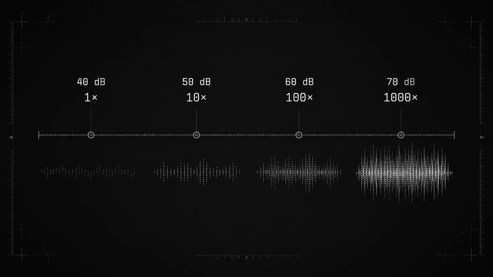

20 Mikropascal und 20 Pascal liegen beim Schalldruck um den Faktor eine Million auseinander. Auf der Dezibelskala werden daraus 0 und 120 dB SPL. Genau für solche Größenordnungen ist die logarithmische Darstellung gemacht. [BIPM][1]

Sie verkürzt sehr große Zahlenverhältnisse. Zugleich bildet sie typische Rechenvorgänge in der Akustik so ab, dass aus Multiplikation eine Addition von Pegeldifferenzen wird.

[Was ist ein Dezibel? Schallpegel einfach erklärt](/de/artikel/was-ist-ein-dezibel/)

## Eine lineare Skala wäre kaum lesbar

Schall in Luft erzeugt Druckschwankungen. Sehr leise und sehr hohe Schalldruckpegel unterscheiden sich um viele Größenordnungen. Würde ein Schallpegelmesser ausschließlich Pascal anzeigen, wären Vergleiche unnötig umständlich.

Der Bezugswert für den Schalldruckpegel in Luft beträgt 20 Mikropascal. Daraus ergeben sich beispielsweise:

| Schalldruck | Schalldruckpegel |
|---:|---:|
| 20 µPa | 0 dB SPL |
| 200 µPa | 20 dB SPL |
| 2 mPa | 40 dB SPL |
| 20 mPa | 60 dB SPL |
| 0,2 Pa | 80 dB SPL |
| 2 Pa | 100 dB SPL |
| 20 Pa | 120 dB SPL |

Jeder Schritt um 20 dB entspricht dabei dem zehnfachen Schalldruck. Die Zahlen bleiben übersichtlich, obwohl das zugrunde liegende Verhältnis stark wächst.

## Die beiden gebräuchlichen Formeln

Für leistungsähnliche Größen wie Schallintensität oder Schallenergie wird eine Pegeldifferenz so berechnet:

\[
\Delta L = 10\log_{10}\left(\frac{X_2}{X_1}\right)
\]

Für eine amplitudenähnliche Größe wie den Schalldruck gilt:

\[
\Delta L = 20\log_{10}\left(\frac{p_2}{p_1}\right)
\]

Der Faktor 20 folgt aus dem quadratischen Zusammenhang zwischen Schalldruck und Schallleistung unter vergleichbaren Bedingungen. Setzt man das Quadrat des Druckverhältnisses in die 10-log-Regel ein, entsteht die 20-log-Form. Es handelt sich nicht um zwei verschiedene Dezibelskalen. [BIPM][1]

## Was 3, 6, 10 und 20 dB physikalisch bedeuten

Die häufig genannten Pegeländerungen stehen für feste Verhältnisse:

| Pegeländerung | Verhältnis von Intensität oder Energie | Verhältnis der Schalldruckamplitude |
|---|---:|---:|
| 3 dB | etwa 2-fach | etwa 1,41-fach |
| 6 dB | etwa 4-fach | etwa 2-fach |
| 10 dB | 10-fach | etwa 3,16-fach |
| 20 dB | 100-fach | 10-fach |

Die exakte Verdopplung der Energie liegt bei rund 3,01 dB. Die Angabe 3 dB ist die übliche Rundung.

Bei 6 dB sind zwei Aussagen gleichzeitig richtig: Die Schalldruckamplitude ist ungefähr doppelt so groß, die Schallintensität oder Energie ungefähr viermal so groß. Wer nur von einer "Verdopplung" spricht, muss deshalb dazusagen, welche Größe gemeint ist.

10 dB mehr entsprechen der zehnfachen Schallintensität. Als Wahrnehmungsregel gilt häufig: ungefähr doppelt so laut. Die BAuA beschreibt diese Beziehung ebenfalls als Faustregel, nicht als exakte Reaktion des Gehörs auf jeden Schall. [BAuA Gehörerhaltung][2]

## Warum Verhältnisse zu Differenzen werden

Logarithmen machen aus einer Multiplikation eine Addition. Ein Beispiel:

Eine Stufe eines akustischen Systems erhöht die Leistung um den Faktor 10. Das sind 10 dB. Eine zweite Stufe verdoppelt sie, also ungefähr 3 dB. Zusammen ergibt sich ein Leistungsverhältnis von 20 zu 1 und eine Pegeländerung von ungefähr 13 dB.

\[
10\ \mathrm{dB} + 3\ \mathrm{dB} \approx 13\ \mathrm{dB}
\]

Auf der linearen Ebene wurde multipliziert, auf der logarithmischen Ebene addiert. Das ist bei Verstärkung, Dämpfung, Übertragungsverlusten und mehreren Schallquellen praktisch.

Eine Verringerung um 10 dB teilt die Intensität durch 10. Eine Verringerung um 20 dB teilt sie durch 100.

## Warum zwei Pegel nicht normal addiert werden

60 dB plus 60 dB ergeben nicht 120 dB. Jeder der beiden Werte steht bereits für ein logarithmisches Verhältnis. Zuerst müssen die zugehörigen Intensitäten oder mittleren Schalldruckquadrate addiert werden, danach wird das Ergebnis wieder in Dezibel umgerechnet.

Für zwei unabhängige gleich laute Quellen gilt:

\[
L_{\mathrm{gesamt}} = L + 10\log_{10}(2) \approx L + 3{,}01\ \mathrm{dB}
\]

Zwei unabhängige Quellen mit jeweils 60 dB ergeben daher etwa 63 dB. Das Umweltbundesamt erklärt dasselbe Prinzip mit zwei Quellen von jeweils 50 dB, die gemeinsam 53 dB erreichen. [UBA Pegelsummation][3]

So einfach ist es nur bei unabhängigen oder inkohärenten Signalen. Zwei kohärente Töne können sich abhängig von Phase und Messposition stärker addieren oder teilweise auslöschen. Bei perfekt gleichphasigen Drucksignalen ist an einem Punkt ein Anstieg um bis zu 6 dB möglich.

## Ein kurzer Blick auf den Abstand

Die logarithmische Skala zeigt sich auch bei der Schallausbreitung. Im idealen freien Schallfeld sinkt der Pegel einer punktförmigen Quelle bei jeder Verdopplung des Abstands um ungefähr 6 dB. Bei einer idealisierten linienförmigen Quelle sind es ungefähr 3 dB. Das Umweltbundesamt nennt als Beispiele eine einzelne Maschine und eine lange Straße. [UBA Messgrößen][4]

In einem Raum gilt diese Regel nicht pauschal. Wände, Decke, Boden und Gegenstände reflektieren den Schall. Mehrere Quellen und gerichtete Abstrahlung verändern das Feld zusätzlich.

## Die Skala ist kein vollständiges Modell der Lautheit

Die logarithmische Darstellung passt gut zum großen Dynamikbereich des Gehörs. Ein dB-Wert sagt trotzdem nicht vollständig voraus, wie laut ein Geräusch erscheint.

Die Wahrnehmung hängt ab von:

- Frequenz und Spektralverteilung
- Ausgangspegel
- Dauer und zeitlichem Verlauf
- Ton, Sprache, Musik oder breitbandigem Geräusch
- Raum, Kopfhörer oder freiem Schallfeld
- Alter und Hörvermögen
- Maskierung, Gewöhnung und Kontext

Ein 10-dB-Unterschied zwischen zwei gleichartigen, stationären Geräuschen kann ungefähr einer Verdopplung der Lautheit entsprechen. Bei kurzen Tönen, stark tieffrequentem Schall oder wechselnden Signalen kann der Eindruck anders ausfallen.

Die Dezibelskala löst ein Mess- und Verhältnisproblem. Sie ersetzt kein Lautheitsmodell.

## dB-Werte richtig vergleichen

Eine Pegeldifferenz ist nur dann sinnvoll, wenn die Messgrößen zusammenpassen. Frequenzbewertung, Zeitbewertung, Bandbreite, Bezugsgröße und Messposition sollten gleich oder zumindest dokumentiert sein.

Ein dB(A)-Wert lässt sich nicht ohne Weiteres mit einem dB(C)-Wert vergleichen. Ebenso darf ein energieäquivalenter Mittelungspegel nicht durch den arithmetischen Mittelwert mehrerer Displaywerte ersetzt werden.

Bei 3 dB geht es um Energie. Bei 6 dB kann der Schalldruck doppelt so groß sein. Bei der wahrgenommenen Lautheit gelten wieder andere Zusammenhänge.

## Pegeländerungen mit dBcheck beobachten

Die logarithmische Wirkung lässt sich mit dBcheck an einer konstanten Quelle vergleichen, etwa bei zwei festen Abständen oder zwei Betriebsstufen eines Haushaltsgeräts. Position, Ausrichtung und Messdauer sollten dabei unverändert bleiben. Das Smartphone zeigt Schätzwerte, deren Genauigkeit vom Mikrofon, von der Signalverarbeitung und von der Kalibrierung abhängt.

## Quellen

1. BIPM, *The International System of Units (SI Brochure), 9th edition*. [https://www.bipm.org/documents/20126/41483022/SI-Brochure-9-EN.pdf](https://www.bipm.org/documents/20126/41483022/SI-Brochure-9-EN.pdf)
2. Bundesanstalt für Arbeitsschutz und Arbeitsmedizin, *Safe and Sound, Ratgeber zur Gehörerhaltung in der Musik*. [https://www.baua.de/DE/Angebote/Publikationen/Praxis/A87.pdf?__blob=publicationFile&v=2](https://www.baua.de/DE/Angebote/Publikationen/Praxis/A87.pdf?__blob=publicationFile&v=2)
3. Umweltbundesamt, *Dezibel und Pegelsummation*. [https://www.umweltbundesamt.de/dezibel-pegelsummation](https://www.umweltbundesamt.de/dezibel-pegelsummation)
4. Umweltbundesamt, *Messgrößen und Pegel*. [https://www.umweltbundesamt.de/messgroessen-pegel](https://www.umweltbundesamt.de/messgroessen-pegel)

[1]: https://www.bipm.org/documents/20126/41483022/SI-Brochure-9-EN.pdf
[2]: https://www.baua.de/DE/Angebote/Publikationen/Praxis/A87.pdf?__blob=publicationFile&v=2
[3]: https://www.umweltbundesamt.de/dezibel-pegelsummation
[4]: https://www.umweltbundesamt.de/messgroessen-pegel
