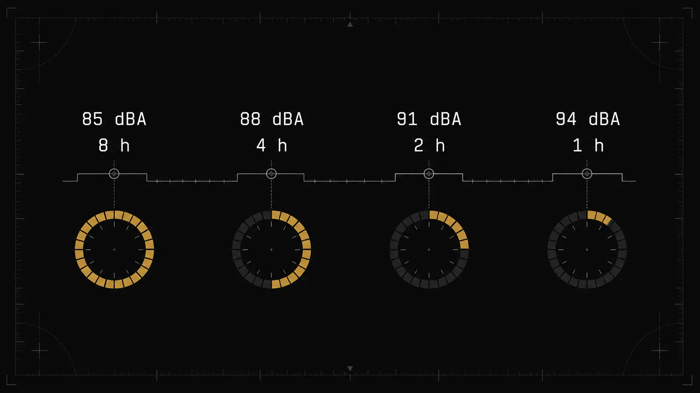

85 dB sind weder eine universelle Sicherheitsgrenze noch der Punkt, an dem ein Hörschaden plötzlich beginnt. Wichtig ist die Zahl vor allem deshalb, weil 85 dB(A) in Deutschland den oberen Auslösewert für den Tages-Lärmexpositionspegel am Arbeitsplatz markieren. Wird er erreicht oder überschritten, folgen konkrete Pflichten zu Lärmminderung, Kennzeichnung und Gehörschutz. [LärmVibrationsArbSchV][1]

Für die tatsächliche Belastung zählen Pegel, Dauer, Wiederholung, Spitzen, Frequenzverteilung und die individuelle Empfindlichkeit.

[Welcher Dezibelwert ist sicher?](/de/artikel/welcher-dezibelwert-ist-sicher/)

## 85 dB(A) sind ein Acht-Stunden-Wert

Die genaue Größe lautet LEX,8h = 85 dB(A). Sie bezieht sich auf eine Achtstundenschicht und fasst alle am Arbeitsplatz auftretenden Schallereignisse energetisch zusammen. Ein einzelner Live-Wert von 85 dB(A) ist noch kein Tages-Lärmexpositionspegel.

Eine Person kann während einer Schicht mehrere Tätigkeiten ausführen. Lautere und leisere Abschnitte werden auf einen gemeinsamen Acht-Stunden-Bezug umgerechnet. Die BAuA verwendet dafür:

\[
L_{EX,8h}=L_{Aeq,T}+10\log_{10}\left(\frac{T}{8\,h}\right)
\]

Wer vier Stunden lang 85 dB(A) ausgesetzt ist und anschließend vier Stunden in einer ruhigen Umgebung arbeitet, erreicht nicht denselben LEX,8h wie bei acht durchgehenden Stunden mit 85 dB(A). Der Acht-Stunden-Wert liegt für den lauten Abschnitt allein 3 dB niedriger. [BAuA][2]

Der obere Auslösewert ist also kein Timer, der beim ersten Erreichen von 85 dB startet.

## Die 3-dB-Beziehung macht kleine Pegelunterschiede relevant

Schallenergie und Dezibel hängen logarithmisch zusammen. Eine Erhöhung um 3 dB verdoppelt unter vergleichbaren Bedingungen annähernd die Schallenergie. Für dieselbe energiebezogene Exposition halbiert sich die Zeit.

Ausgehend von 85 dB(A) über acht Stunden entstehen folgende Kombinationen:

| Pegel | Energieäquivalente Dauer |
|---:|---:|
| 85 dB(A) | 8 Stunden |
| 88 dB(A) | 4 Stunden |
| 91 dB(A) | 2 Stunden |
| 94 dB(A) | 1 Stunde |
| 97 dB(A) | 30 Minuten |
| 100 dB(A) | 15 Minuten |

Sechs Dezibel wirken auf dem Display nicht wie ein großer Sprung. Energetisch verkürzt sich die Vergleichszeit von acht auf zwei Stunden. Genau deshalb reicht die Aussage "nur etwas lauter" bei längerer Exposition nicht aus.

[Sind 3 dB doppelt so laut? Schallenergie und Lautheit](/de/artikel/sind-3-db-doppelt-so-laut/)

## Was der obere Auslösewert rechtlich auslöst

Ab LEX,8h = 85 dB(A) oder LpC,peak = 137 dB(C) greift der obere Auslösewert der LärmVibrationsArbSchV. Der Arbeitgeber muss dafür sorgen, dass Beschäftigte geeigneten Gehörschutz bestimmungsgemäß verwenden. [LärmVibrationsArbSchV][1]

Arbeitsbereiche, in denen diese Werte überschritten werden können, sind als Lärmbereiche zu kennzeichnen und soweit möglich abzugrenzen. Wird der obere Auslösewert überschritten, ist ein Programm mit technischen und organisatorischen Maßnahmen zur Lärmminderung erforderlich.

Gehörschutz steht dabei nicht an erster Stelle. Die Verordnung verlangt zunächst, Lärm an der Quelle zu verhindern oder so weit wie möglich zu verringern. Technische Maßnahmen haben Vorrang vor organisatorischen Lösungen. Erst danach folgt der persönliche Gehörschutz.

Auch die arbeitsmedizinische Vorsorge verschärft sich. Bei Erreichen oder Überschreiten der oberen Auslösewerte ist nach der ArbMedVV Pflichtvorsorge vorgesehen. [ArbMedVV][3]

## Warum 80 dB(A) ebenfalls eine wichtige Zahl sind

Der untere Auslösewert liegt bereits bei LEX,8h = 80 dB(A). Für Spitzen gilt 135 dB(C). Werden diese Werte trotz vorrangiger Schutzmaßnahmen nicht eingehalten, muss geeigneter Gehörschutz bereitgestellt werden. Hinzu kommen Information, Unterweisung und Angebotsvorsorge.

Die Stufen zeigen, warum eine einfache Grenze bei 85 dB zu grob wäre. Schutz beginnt nicht erst am oberen Auslösewert. Schon ab 80 dB(A) setzt das deutsche Regelwerk an.

Unterhalb von 80 dB(A) können außerdem andere Wirkungen auftreten. Lärm kann Sprache verdecken, Fehler begünstigen, Stress verursachen oder Konzentration und Erholung beeinträchtigen. Der Tages-Lärmexpositionspegel wurde vor allem für die Beurteilung einer möglichen Gehörgefährdung entwickelt und erfasst nicht jede Lärmwirkung gleich gut. [BAuA][2]

## 85 dB(A) sind keine magische Gefahrengrenze

Ein kurzer Moment bei 86 dB(A) beweist keinen Hörschaden. Acht Stunden knapp unter 85 dB(A) garantieren umgekehrt keine vollständige Risikofreiheit. Bevölkerungsbezogene Grenz- und Auslösewerte können individuelle Reaktionen nicht exakt vorhersagen.

Das Umweltbundesamt nennt Stärke und Dauer gemeinsam als die wichtigsten Größen. Sowohl anhaltend hoher Dauerschall als auch kurze hohe Spitzen können das Gehör beeinträchtigen oder dauerhaft schädigen. [Umweltbundesamt][4]

Weitere Einflüsse sind:

- frühere und wiederholte Exposition
- Frequenzspektrum des Geräuschs
- impulsartiger oder kontinuierlicher Verlauf
- Abstand und Raumreflexionen
- Passform und reale Dämmwirkung des Gehörschutzes
- individuelle Empfindlichkeit
- Messunsicherheit

Eine einzelne Zahl kann diese Faktoren nicht ersetzen.

## Freizeit und Arbeit verwenden unterschiedliche Zeiträume

Für Freizeit und persönliches Musikhören nennt die WHO 80 dB über 40 Stunden pro Woche als Referenz. Bei 85 dB reduziert sich die Wochenzeit auf 12 Stunden 30 Minuten. [WHO][5]

Das unterscheidet sich deutlich vom deutschen Arbeitsschutz. Dort ist 85 dB(A) ein auf acht Stunden bezogener oberer Auslösewert mit Pflichten für Arbeitgeber. Die WHO-Tabelle verteilt eine empfohlene Schallmenge über sieben Tage.

Beide Modelle verwenden die physikalische 3-dB-Beziehung, sind aber nicht austauschbar. Die Aussage "85 dB sind für acht Stunden sicher" passt weder zur deutschen Rechtslage noch zur WHO-Wochenempfehlung.

## A-Bewertung gehört zur Zahl

Im Arbeitsschutz lautet die Angabe 85 dB(A), nicht nur 85 dB. Die A-Bewertung gewichtet Frequenzen entsprechend einer festgelegten Filterkurve. Tiefe Frequenzen tragen dadurch weniger zum Gesamtwert bei als bei einer C- oder Z-Bewertung.

Ein tieffrequentes Geräusch kann daher bei gleicher Situation einen deutlich höheren dB(C)- als dB(A)-Wert zeigen. Werte mit verschiedener Frequenzbewertung sollten nicht direkt miteinander verglichen werden.

Auch die Zeitgröße muss genannt werden. LAeq,T, LEX,8h, LAFmax und LpC,peak beantworten unterschiedliche Fragen. 85 dB(A) als LAeq einer Stunde ist nicht dasselbe wie 85 dB(A) als Tages-Lärmexpositionspegel.

[dB und dB(A): Was ist der Unterschied?](/de/artikel/db-und-dba-unterschied/)

## Spitzenpegel werden getrennt bewertet

Die Verordnung koppelt die A-bewerteten Tageswerte an C-bewertete Spitzenwerte. Der untere Spitzenwert liegt bei 135 dB(C), der obere bei 137 dB(C). [LärmVibrationsArbSchV][1]

Diese getrennte Betrachtung ist notwendig, weil ein sehr kurzer Impuls im Acht-Stunden-Mittel kaum auffallen kann. Ein harter Schlag, ein Knall oder eine Explosion kann trotzdem einen extremen momentanen Schalldruck erzeugen.

Smartphone-Mikrofone sind für solche Messungen nicht verlässlich. Bei hohen Pegeln greifen häufig Kompression und Clipping. Die App kann dann einen scheinbar stabilen Wert anzeigen, obwohl der tatsächliche Peak nicht mehr erfasst wird.

## Warum 87 dB(A) in EU-Texten auftauchen

Die EU-Richtlinie 2003/10/EG nennt einen Expositionsgrenzwert von 87 dB(A), wobei die Dämmwirkung des Gehörschutzes berücksichtigt wird. Deutschland hat die Richtlinie mit der LärmVibrationsArbSchV umgesetzt und verlangt für den am Ohr einwirkenden Lärm maximal 85 dB(A) sowie 137 dB(C). [EU-Richtlinie][6] [LärmVibrationsArbSchV][1]

Wer in Deutschland arbeitet, sollte deshalb nicht nur eine EU-Übersicht lesen und daraus 87 dB(A) als nationale Grenze übernehmen. Die deutsche Vorschrift ist maßgeblich und an dieser Stelle strenger.

[Lärmexpositionsgrenzen in Deutschland und der EU](/de/artikel/laermexpositionsgrenzen-deutschland-eu/)

## Wie 85 dB sinnvoll kommuniziert werden

Eine sachlich korrekte Kurzfassung lautet:

> In Deutschland sind 85 dB(A) als Tages-Lärmexpositionspegel der obere Auslösewert am Arbeitsplatz. Der Wert bezieht sich auf acht Stunden, löst Schutzpflichten aus und ist keine universelle Grenze zwischen sicher und schädlich.

Problematisch wären Aussagen wie:

- "Unter 85 dB ist alles sicher."
- "Nach genau acht Stunden beginnt der Hörschaden."
- "Ein kurzer Messwert über 85 dB bedeutet, dass das Gehör geschädigt wurde."
- "85 dB sind überall acht Stunden lang erlaubt."

Die Zahl wird erst mit Messgröße, Zeitraum und Regelwerk verständlich.

## 85 dB mit dBcheck einordnen

Nutzen Sie dBcheck für einen längeren A-bewerteten Messverlauf statt für einen einzelnen Spitzenwert. Dokumentieren Sie Abstand, Position, Messdauer und Betriebszustand. Bei Werten in der Nähe arbeitsrechtlicher Schwellen, bei Impulsschall oder bei der Auswahl von Schutzmaßnahmen ist eine fachkundige professionelle Messung erforderlich.

[Wie lange können Sie 85 dB hören?](/de/artikel/wie-lange-85-db-hoeren/)

[Was ist eine Lärmdosis?](/de/artikel/was-ist-eine-laermdosis/)

## Quellen

1. Lärm- und Vibrations-Arbeitsschutzverordnung. [https://www.gesetze-im-internet.de/l_rmvibrationsarbschv/](https://www.gesetze-im-internet.de/l_rmvibrationsarbschv/)
2. Bundesanstalt für Arbeitsschutz und Arbeitsmedizin, *Handbuch Gefährdungsbeurteilung: Lärm*. [https://www.baua.de/DE/Themen/Arbeitsgestaltung/Gefaehrdungsbeurteilung/Handbuch-Gefaehrdungsbeurteilung/Expertenwissen/Physikalische-Einwirkungen/Laerm/Laerm_dossier](https://www.baua.de/DE/Themen/Arbeitsgestaltung/Gefaehrdungsbeurteilung/Handbuch-Gefaehrdungsbeurteilung/Expertenwissen/Physikalische-Einwirkungen/Laerm/Laerm_dossier)
3. Verordnung zur arbeitsmedizinischen Vorsorge. [https://www.gesetze-im-internet.de/arbmedvv/](https://www.gesetze-im-internet.de/arbmedvv/)
4. Umweltbundesamt, *Gehörschäden*. [https://www.umweltbundesamt.de/themen/laerm/laermwirkungen/gehoerschaeden](https://www.umweltbundesamt.de/themen/laerm/laermwirkungen/gehoerschaeden)
5. World Health Organization, *Deafness and hearing loss: Safe listening*. [https://www.who.int/news-room/questions-and-answers/item/deafness-and-hearing-loss-safe-listening](https://www.who.int/news-room/questions-and-answers/item/deafness-and-hearing-loss-safe-listening)
6. Europäische Union, *Richtlinie 2003/10/EG*. [https://eur-lex.europa.eu/legal-content/DE/TXT/?uri=CELEX:32003L0010](https://eur-lex.europa.eu/legal-content/DE/TXT/?uri=CELEX:32003L0010)

[1]: https://www.gesetze-im-internet.de/l_rmvibrationsarbschv/
[2]: https://www.baua.de/DE/Themen/Arbeitsgestaltung/Gefaehrdungsbeurteilung/Handbuch-Gefaehrdungsbeurteilung/Expertenwissen/Physikalische-Einwirkungen/Laerm/Laerm_dossier
[3]: https://www.gesetze-im-internet.de/arbmedvv/
[4]: https://www.umweltbundesamt.de/themen/laerm/laermwirkungen/gehoerschaeden
[5]: https://www.who.int/news-room/questions-and-answers/item/deafness-and-hearing-loss-safe-listening
[6]: https://eur-lex.europa.eu/legal-content/DE/TXT/?uri=CELEX:32003L0010
