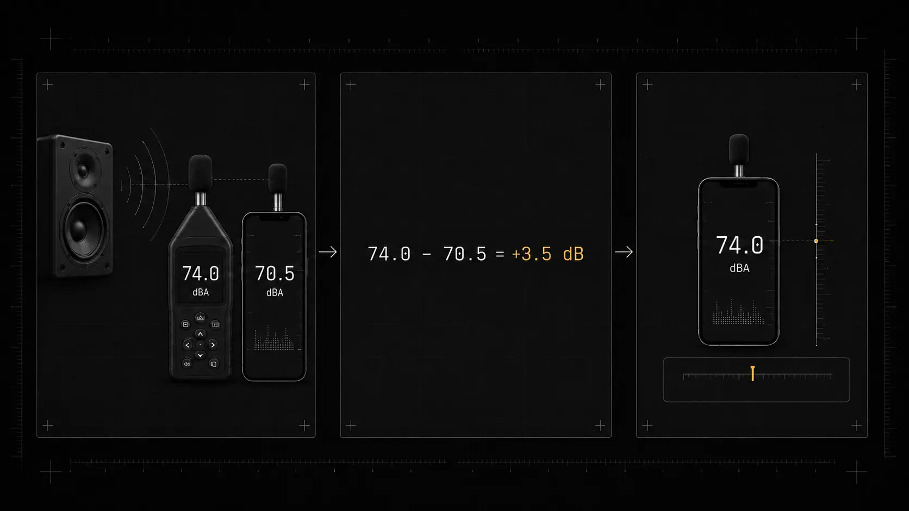

Calibrating a decibel meter app usually means adjusting its reading so that it agrees with a reliable reference under defined conditions. A simple offset can reduce a consistent sensitivity error, but it cannot correct every limitation of the phone microphone, audio processing, frequency response, noise floor, compression, or peak handling. Calibration also does not make an ordinary phone a certified Class 1 or Class 2 sound level meter. [NIOSH guide][1]

[Are Decibel Meter Apps Accurate?](/articles/are-decibel-meter-apps-accurate/)

## What calibration means in a phone app

A phone app converts microphone samples into an estimated sound pressure level. The conversion needs a reference because digital amplitude alone does not identify the acoustic pressure at the microphone.

Many apps provide an offset control. If the phone reads 68 dBA while a trustworthy reference meter reads 72 dBA under the same conditions, a positive 4 dB offset may bring the two values into agreement near that test condition.

This is level alignment, not complete validation. A sound level meter standard tests far more than one broadband value. It can include frequency response, level linearity, time weighting, directional response, self-generated noise, overload behavior, peak response, and environmental performance.

A useful calibration record should state exactly what was adjusted, against which reference, at what level, with which weighting, response time, microphone, app version, and phone.

## What a single offset can correct

A flat offset is most effective when the main error is a stable microphone sensitivity difference. If an app stays about 3 dB below a reference across several levels, a 3 dB correction may improve agreement across that tested range.

An offset cannot reliably correct:

- a microphone that underreports low frequencies but overreports high frequencies
- automatic gain control that changes gain as level changes
- compression or clipping at high levels
- self-noise that raises quiet readings
- an incorrect A, C, or Z weighting filter
- a response time that differs from the reference
- directionality or a blocked microphone port
- short impulse and peak measurement limitations

Describe the calibration control as an adjustment for a known setup, not proof of universal accuracy.

## Choose the strongest reference available

The reference determines how meaningful the calibration is.

The strongest practical options are:

1. a compatible external measurement microphone fitted to an acoustic calibrator
2. a properly calibrated Class 1 or Class 2 sound level meter used for a side-by-side comparison

Do not calibrate against another uncalibrated phone. Two phones can agree and still both be wrong.

A speaker playing a web video, test tone, or phone-generated sound is not a reference level. The sound pressure at the phone depends on the speaker, volume setting, distance, room, orientation, and frequency response. A file labelled 94 dB does not produce 94 dB SPL in an unknown room.

## Method 1: External measurement microphone and acoustic calibrator

This is the most controlled phone calibration method when the app supports a suitable external microphone.

### 1. Use a compatible measurement microphone

Choose a microphone intended for sound level measurement and a compatible USB, audio interface, or adapter path. The microphone and interface should remain the same during calibration and later measurements.

A consumer headset microphone may not have a known sensitivity, flat response, or calibrator-compatible shape. It should not be assumed to improve accuracy merely because it is external.

### 2. Select the final app settings

Before calibration, choose the same settings that will be used during measurements:

- input device
- frequency weighting
- response time or averaging mode
- sample rate where selectable
- calibration profile

Changing the microphone, adapter, input route, or processing path can invalidate the stored correction.

### 3. Fit the acoustic calibrator correctly

Attach a compatible acoustic calibrator to the measurement microphone using the correct coupler. The fit must be airtight and mechanically stable according to the calibrator and microphone instructions.

A calibrator commonly produces 94 dB or 114 dB at 1 kHz. Use the value stated for the exact calibrator and apply any required environmental or pressure correction described by its documentation. [NIOSH guide][1]

Do not attempt to press a normal phone body against a calibrator opening. A calibrator is designed to couple to a measurement microphone with known geometry, not to an internal phone microphone behind a small port.

### 4. Apply the app correction

Start the calibrator and allow the reading to settle. Adjust the app until it displays the calibrator's stated level for the selected setup.

Record:

- microphone and interface
- calibrator make, model, and serial number
- calibrator output level
- date and time
- phone model and operating system
- app version
- weighting and response time
- applied offset

### 5. Check again after important measurements

Professional practice includes a field check before and after a measurement session. NIOSH and OSHA guidance emphasizes calibration checks because drift or a changed setup can weaken the result. [NIOSH guide][1] [OSHA][2]

If the post-measurement check differs materially from the first check, investigate the microphone, adapter, battery, route, settings, and environmental conditions before relying on the session.

A successful calibrator check still does not establish complete Class 1 or Class 2 conformity. Instrument class applies to the complete tested system.

## Method 2: Built-in phone microphone compared with a reference meter

A phone's internal microphone usually cannot be coupled properly to an acoustic calibrator. A side-by-side sound field comparison is the more practical method.

### 1. Prepare a stable sound field

Use a steady broadband source in a controlled room. Broadband sound is generally more useful than a single tone because it reduces the chance of calibrating only one narrow frequency.

The sound should remain stable for the full comparison. Avoid speech, intermittent traffic, music with large level changes, and household sounds that cycle unpredictably.

### 2. Match the measurement settings

Set both systems to the same frequency weighting. If the phone app uses dBA, the reference should also report an A-weighted value.

Match the response time or use comparable equivalent averages. A practical approach is to compare LAeq over the same 30 to 60 second period. Comparing a phone's live Fast value with a reference meter's Slow value does not provide a clean offset.

[dB vs dBA: What Is the Difference?](/articles/db-vs-dba/)
### 3. Place the microphones close together

Position the phone's active microphone and the reference microphone as close together as practical without one blocking or acoustically shadowing the other.

Keep both at the same height and approximately the same distance and angle to the source. Do not place one behind the other. Keep the phone case configuration the same as it will be during later measurements.

Keep the room, source position, phone orientation, stand, and nearby objects fixed.

### 4. Record the reference and phone values

Run both measurements over the same time interval. Repeat the test to confirm that the difference is stable.

Calculate the offset as:

$
\text{Offset} = L_{\text{reference}} - L_{\text{phone}}
$

If the reference reads 74.0 dBA and the phone reads 70.5 dBA, the offset is:

$
74.0 - 70.5 = +3.5\ \mathrm{dB}
$

Enter a positive 3.5 dB correction if the app's calibration control uses the same sign convention. Confirm the result with another measurement rather than assuming the control works as expected.

### 5. Verify more than one sound level

A phone can agree at one level and become inaccurate at another because of automatic gain control, compression, or nonlinear response.

Where the setup permits, compare several levels, such as 50, 70, 85, and 95 dBA. These are verification points, not universal requirements. Do not create unsafe sound levels merely to test the phone.

If the phone needs different offsets at different levels, one flat correction cannot make it accurate across the range. Record the range where agreement is acceptable and treat readings outside it with greater caution.

### 6. Check more than one spectrum when possible

A broadband match can hide frequency-dependent error. A phone may agree for pink noise while underreporting a low-frequency machine or a high-frequency tone.

Professional validation uses controlled frequency tests. Do not create a frequency correction curve from casual room measurements. Reflections and source response can be mistaken for microphone response.

## Why calibration can fail after a software change

An operating system update, app update, changed audio source, connected headset, Bluetooth route, or external adapter can alter the capture path.

Android also permits device-dependent processing. The requested audio source may not provide the same signal on every model. A saved offset should be rechecked after material software or hardware changes.

Recheck calibration after:

- app or operating system updates
- a changed microphone or adapter
- phone repair or damage
- moisture, dust, or cleaning near a microphone port
- a changed case
- an unexpected difference between repeated measurements

## When an external microphone helps

A suitable external measurement microphone can improve sensitivity consistency, frequency response, placement, wind protection, and compatibility with an acoustic calibrator.

Kardous and Shaw reported close agreement for selected apps used with calibrated external microphones in a controlled range. Celestina and colleagues found that one specific phone, app, and external microphone system met most of the periodic Class 2 requirements they tested. [Kardous and Shaw][3] [Celestina et al.][4]

The input interface may resample, change gain, clip, or route the signal unexpectedly. The app's weighting and detector calculations can also be wrong. An external microphone does not independently create a certified measurement system.

## Calibration does not remove quiet and high-level limits

At quiet levels, the microphone and electronics noise floor may keep the reading above the real sound. Serpanos and colleagues found that calibration improved measurements at 40 dBA and above in their tested systems, while levels below 40 dBA remained overestimated. [Serpanos et al.][5]

At high levels, compression or clipping can cause underreporting. Adding an offset to a compressed signal cannot restore information that the microphone or input path failed to capture.

A correct calibration value at 70 dBA does not prove valid measurement at 30 dBA, 100 dBA, or during a very short impulse.

## Save the calibration as a defined profile

A useful profile identifies:

- phone model and unit
- app version
- operating system version
- built-in or external microphone
- interface or adapter
- case status
- weighting and response time
- reference instrument or calibrator
- reference level and sound type
- offset
- verified level range
- calibration date

Use separate profiles for different external microphones or routes. Do not keep a profile active after the selected input changes.

## Apply calibration in dBcheck without overstating it

Use a dBcheck calibration profile to store an adjustment for the exact phone and input setup you tested. Compare the profile against a reliable reference and recheck it after changes. The profile can improve agreement and repeatability, but it does not certify dBcheck or the phone as a Class 1 or Class 2 sound level meter.

[Phone Sound Meter vs Professional Sound Level Meter](/articles/phone-sound-meter-vs-professional-meter/)
## Sources

1. CDC/NIOSH, *NIOSH Sound Level Meter Application: Features and Instructions*. [https://www.cdc.gov/niosh/media/pdfs/NIOSH-Sound-Level-Meter-Application-app-English.pdf](https://www.cdc.gov/niosh/media/pdfs/NIOSH-Sound-Level-Meter-Application-app-English.pdf)
2. OSHA Technical Manual, Section III, Chapter 5. [https://www.osha.gov/otm/section-3-health-hazards/chapter-5](https://www.osha.gov/otm/section-3-health-hazards/chapter-5)
3. Kardous and Shaw, *Evaluation of smartphone sound measurement applications using external microphones: A follow-up study*. [https://europepmc.org/article/MED/27794313](https://europepmc.org/article/MED/27794313)
4. Celestina, Hrovat, and Kardous, *Smartphone-based sound level measurement apps: Evaluation of compliance with international sound level meter standards*. [https://doi.org/10.1016/j.apacoust.2018.04.011](https://doi.org/10.1016/j.apacoust.2018.04.011)
5. Serpanos et al., *The Accuracy of Smartphone Sound Level Meter Applications in Measuring Sound Levels in Clinical Rooms*. [https://europepmc.org/article/MED/33469901](https://europepmc.org/article/MED/33469901)

[1]: https://www.cdc.gov/niosh/media/pdfs/NIOSH-Sound-Level-Meter-Application-app-English.pdf
[2]: https://www.osha.gov/otm/section-3-health-hazards/chapter-5
[3]: https://europepmc.org/article/MED/27794313
[4]: https://doi.org/10.1016/j.apacoust.2018.04.011
[5]: https://europepmc.org/article/MED/33469901
